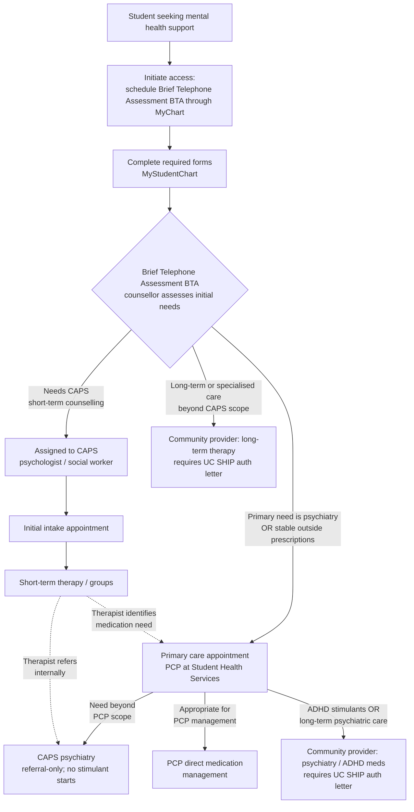

# Health and Insurance

!!! danger "In a crisis"
    **24 hr Mental Health Crisis Line: 619-236-3339**
    Medical emergency: **911** or 858-534-4357.
    Full list on the [Department Directory](directory.md).

## UC SHIP

**UC SHIP** is the student health insurance plan — medical, behavioral health,
pharmacy, dental, and vision. It is Affordable Care Act compliant and designed
to complement care at Student Health Services on campus.

**Enrollment is automatic for registered students.** A waiver application is
available if you have other coverage.

!!! warning "Waiving has consequences"
    Students who waive UC SHIP may still use Student Health Services, but
    **modest fees apply to all services**, and **SHS does not accept or bill
    other insurance plans**. If you waive, look at **RAFT** (Reduced Access Fee
    For Tritons), which lets students who waived be seen at SHS for many
    primary care needs without high costs.

Waiver deadlines and criteria are on the "How to Waive UC SHIP" page. Note the
deadline — it is early, and missing it means you are enrolled and billed.

Students employed as **TAs, graders, or GSRs at 25% time or more** have health
insurance covered as a benefit of employment for that quarter — see
[Funding and Fees](funding.md#what-employment-covers).

## Student Health Services

SHS provides primary medical and urgent care, with laboratory, x-ray, pharmacy,
nutrition, and optometry support. Staffed by board-certified primary care
physicians and nurse practitioners, some with additional training in
reproductive health, sports medicine, urgent care, and mental/behavioral
health.

**Most services are free for students enrolled in UC SHIP.**

| | |
| --- | --- |
| **Location** | Triton Health and Wellness Building (9520 Gilman Dr) |
| **Hours** | Monday–Friday, 8:00 a.m. – 4:00 p.m. |
| **Phone** | (858) 534-3300 |
| **Fax** | (858) 534-7545 |
| **Email** | studenthealth@ucsd.edu |

!!! tip "Write "secure:" in the subject line"
    When emailing SHS, always begin the subject line with the word **secure:**
    to protect your personal information.

Check [the website](https://studenthealth.ucsd.edu/) for hours, especially during holidays.

## Counseling and Psychological Services

**CAPS** provides mental health support to graduate students. The process to get the help you need (counseling, medication, etc.) is complicated and not very well-explained, so here is a flowchart to understand the steps you need to take. Every route in starts the same way: **you must schedule a Brief Telephone Assessment (BTA)**. Where you go next depends on what that assessment finds.

!!! warning "Two things students get caught by"
    **CAPS psychiatry is referral-only** — you cannot book it directly, and it
    does not start stimulant prescriptions. ADHD medication and long-term
    psychiatric care are referred out to community providers.

    **Community referrals need a UC SHIP authorisation letter.** Get it before
    booking, or the visit may not be covered.

Copays vary depending on where treatment was received.

**Internal**: 

- Services provided by SHS or CAPS directly, located on-campus &rarr; Copay = $0
- UC-system providers, i.e. services under the UCSD Health umbrella (e.g. UCSD Outpatient Psychiatry) &rarr; Copay = $5

**External**:

- In-network private practice therapists, psychiatrists, or clinics in the area that are in-network with Anthem Blue Cross (provider for UC SHIP) &rarr; Copay = $10
- Out-of-network providers &rarr; Not covered

## Related

- [Campus Services](campus-services.md) — the wider A–Z.
- [Funding and Fees](funding.md) — what employment covers.
