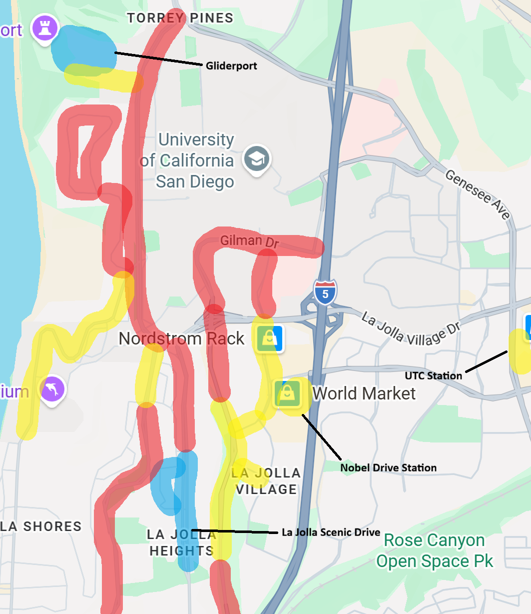

# Transportation

Getting to and around campus. Everything below goes through **UCSD Transportation Services**.

## Campus shuttle — free

UCSD students get **free, unlimited rides on the Campus Shuttle year-round** with their Campus ID card. No pass, no fare, no sign-up.

## MTS bus and trolley — Triton U-Pass

The **Triton U-Pass** grants unlimited access to regional **MTS and NCTD** bus and trolley/light rail routes during the fall, winter, spring, and as of 2025 (thanks to the union) summer academic quarters.

Note the gap: coverage is by academic quarter, so check what applies over
summer if you are here year-round.

## Parking

### Paid parking

Parking permits are available for purchase [online](https://transportation.ucsd.edu/commute/permits/index.html). Graduate students are eligable for a **B** parking pass, and this permits you to "park down", i.e. park in available undergraduate (S) parking. If you commute by car daily, the consecutive rate is lower than a per-day parking, at $133/month. Parking for a single day is $6.35 via the [ParkMobile](https://parkmobile.io/) app. On the app, use code 47300 to specify B parking. B parking permits you to park in those spaces 24/7.

Parking is first come, first served, and certain lots fill up much earlier than others. You can find the general availability per day, per time [here](https://transportation.ucsd.edu/commute/permits/availability.html). The closest parking garage to Mayer Hall is the South Parking Structure, but the B parking spots fill up very fast, so if you plan to park here get there early.

### Free Parking

UCSD generally discourages commuting to campus by car, hence why their parking costs so much. Because of this, free parking is even harder to find than the paid on-campus options. However, there are a few options worth knowing. Below are the places that I (Matt) could verify. Red represents locations where street parking is not allowed at all, or only limited to 2 hours; any arbitrary text

<figure markdown>
  { width="600" }
  <figcaption>Free street parking near campus as of 2026. Verify street signage, restrictions change. Highly proprietary. Do not share externally.</figcaption>
</figure>

## Biking and walking

Replace this with what students actually do — bike routes worth knowing, where
to park a bike securely, and whether the hill is as bad as it looks.

## Getting from the airport

Replace this with the practical options and rough costs from SAN, which is the
first question every incoming student asks.

## Related

- [Housing](index.md#housing) — where you live determines all of this.
- [Campus Services](../resources/campus-services.md) — Transportation Services
  and the wider A–Z.
